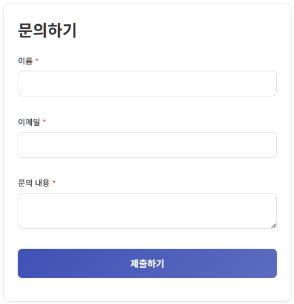

# shakeForm

다양한 웹폼을 만들 수 있는 재사용 가능한 웹 컴포넌트입니다. 기업 홈페이지의 "문의하기" 페이지나 다양한 데이터 수집 폼에서 사용할 수 있습니다.

## ✨ 주요 기능

- **쉬운 사용법**: 코드를 잘 몰라도 간단한 속성 설정만으로 폼을 만들 수 있습니다.
- **Web Components 기반**: Shadow DOM을 사용하여 기존 웹사이트 스타일에 영향을 주지 않고 독립적으로 작동합니다.
- **강력한 커스터마이징**: 7가지 필드 타입, 테마, 폰트, CSS 변수, 커스텀 CSS 등 개발자를 위한 다양한 옵션을 제공합니다.
- **데이터 처리 용이**: 폼 데이터를 JSON 형태로 쉽게 얻을 수 있으며, 서버 전송을 위한 이벤트를 지원합니다.
- **실시간 유효성 검증**: 필수 입력 항목과 데이터 형식을 실시간으로 검증합니다.

---

## 🚀 빠른 시작

웹페이지에 아래 코드를 추가하면 바로 작동하는 문의 폼이 만들어집니다.

### 1. 스크립트 추가

```html
<!-- HTML 파일의 <head> 또는 <body> 끝에 추가합니다. -->
<script src="shakeForm.js"></script>
```

또는 CDN을 통해 직접 불러올 수도 있습니다:

```html
<script src="https://keneslab.github.io/shakeForm/shakeForm.js"></script>
```

### 2. 폼 삽입

```html
<!-- 폼을 표시하고 싶은 곳에 아래 코드를 추가합니다. -->
<shake-form
  title="문의하기"
  submit-text="제출하기">
</shake-form>

<script>
  const form = document.querySelector('shake-form');

  // 폼에 표시될 필드를 설정합니다.
  const myFields = [
    { name: 'name', label: '이름', type: 'text', required: true },
    { name: 'email', label: '이메일', type: 'email', required: true },
    { name: 'message', label: '문의 내용', type: 'textarea', required: true }
  ];
  form.setFields(myFields);

  // 폼 제출 시 데이터를 받아서 처리합니다.
  form.addEventListener('formsubmit', (event) => {
    console.log('제출된 데이터:', event.detail);
    alert('문의가 접수되었습니다.');
  });
</script>
```
### 실행 결과

위 코드를 실행하면 다음과 같은 폼이 생성됩니다:



---

## 📚 문서 안내

`shakeForm`은 사용자의 숙련도에 따라 맞춤형 문서를 제공합니다.

### 👤 초보자용 안내서

코딩 경험이 적거나, 빠르고 간단하게 폼을 만들어야 하는 분들을 위한 문서입니다. 복사-붙여넣기 예제와 쉬운 설명으로 구성되어 있습니다.

➡️ **[초보자용 안내서 바로가기 (BEGINNER_GUIDE.md)](./BEGINNER_GUIDE.md)**

### 👨‍💻 개발자용 고급 안내서

`shakeForm`의 모든 기능을 활용하고 싶은 개발자를 위한 기술 문서입니다. API, 고급 스타일링, 동적 제어 등 상세한 정보를 포함합니다.

➡️ **[개발자용 고급 안내서 바로가기 (ADVANCED_GUIDE.md)](./ADVANCED_GUIDE.md)**

### 📖 사용 예시 모음

다양한 상황에 맞는 코드 예제가 필요하신가요? 전체 필드 구성, 유효성 검증, 테마, 레이아웃 등 실제 사용 사례를 모아둔 문서입니다.

➡️ **[다양한 사용 예시 보러가기 (EXAMPLES.md)](./EXAMPLES.md)**

### 📘 API 리퍼런스 매뉴얼

모든 API, 메서드, 이벤트, CSS 변수에 대한 완전한 참조 문서가 필요하신가요? 상세한 타입 정의와 고급 스타일링 옵션까지 포함된 완벽한 레퍼런스입니다.

➡️ **[API 리퍼런스 매뉴얼 바로가기 (REFERENCE_MANUAL.md)](./REFERENCE_MANUAL.md)**

---

## 🌐 브라우저 호환성

최신 버전의 Chrome, Firefox, Safari, Edge 등 Web Components를 지원하는 모든 모던 브라우저에서 작동합니다. Internet Explorer는 지원하지 않습니다.